# Rapport d'Installation et Configuration : Serveur Nextcloud sur Proxmox

## 1. Préparation de l'Infrastructure (Proxmox)
La solution est hébergée sur une machine virtuelle Ubuntu 24.04 LTS configurée avec les ressources suivantes :

* **OS :** Ubuntu 24.04 LTS
* **RAM :** 8 GB
* **CPU :** 4 vCPU
* **Disque :** 100 GB

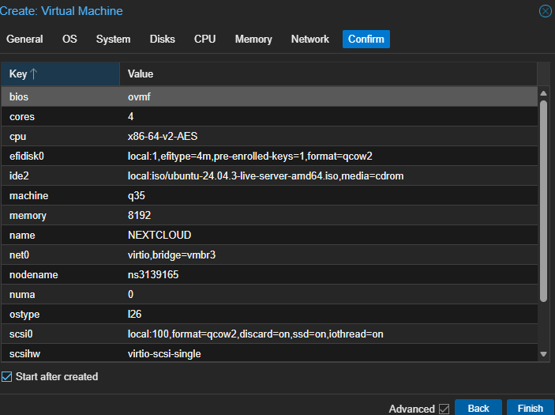

### Configuration Réseau
L'adresse IP statique a été définie lors de l'installation du système :
* **Nom d'hôte :** `vmrb3`
* **Adresse IP :** `172.16.0.15/24`

---

## 2. Installation et Profil Serveur
Création du profil utilisateur système pour la gestion du serveur :
* **Utilisateur :** `XXXXXXXXXX`

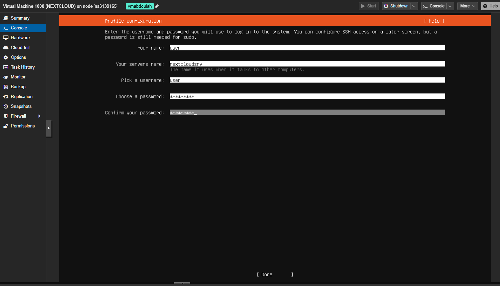

### Initialisation de Nextcloud
L'interface de configuration est accessible via l'URL : `http://172.16.0.15`

**Paramètres de la base de données :**
* **Utilisateur Admin Nextcloud :** `admin`
* **Utilisateur BDD :** `NexcloudAbd`
* **Mot de passe BDD :** `XXXXXXXXXX`

> **Statut :** Installation terminée avec succès.
> 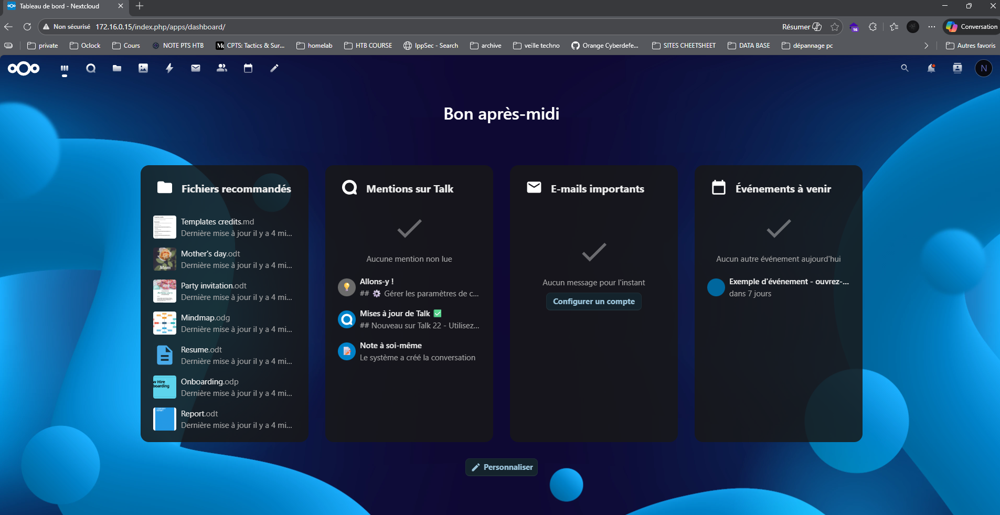

---

## 3. Gestion des Applications et Services

### Tableau des applications vérifiées

| Application | Rôle | Catégorie | Installation |
| :--- | :--- | :--- | :--- |
| **Nextcloud Talk** | Chat + Visioconférence | Communication | Par défaut |
| **Calendar** | Calendriers partagés | Organisation | Par défaut |
| **Contacts** | Carnet d'adresses | Organisation | Par défaut |
| **Deck** | Tableaux Kanban | Organisation | Réalisé |
| **OnlyOffice** | Suite bureautique collaborative | Bureautique | Réalisé |
| **Tasks** | Gestion de tâches | Organisation | Réalisé |
| **Community Document Server** | Gestion de documents | Bureautique | Réalisé |

**Vérification de ONLYOFFICE :** Le service est pleinement fonctionnel.
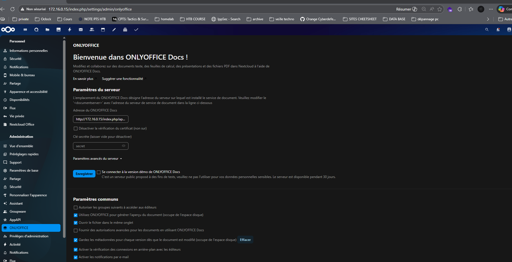

---

## 4. Gestion des Utilisateurs et Groupes

### Automatisation de la création
Création des groupes et de **15 utilisateurs** (Mot de passe : `rocknroll26!`).

* **Groupes :** 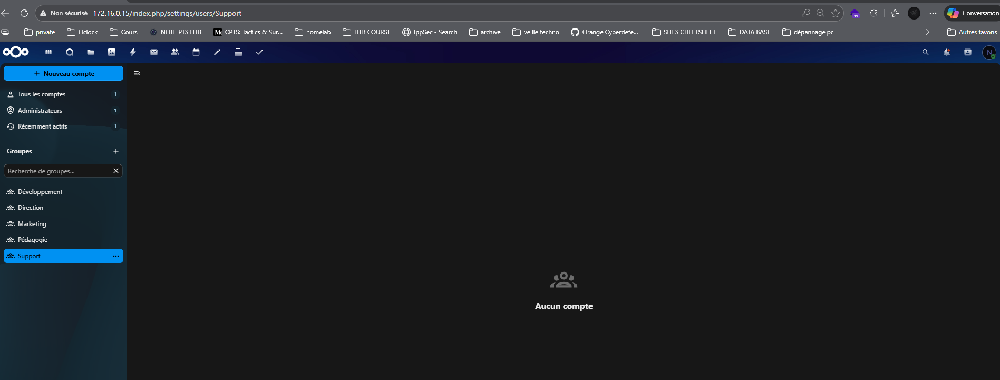
* **Script d'importation :** Utilisation d'un fichier CSV et d'un script Bash.
    * [Fichier CSV des utilisateurs](doc/utilisateurs.csv)
    * [Script d'importation Shell](doc/import_users.sh)

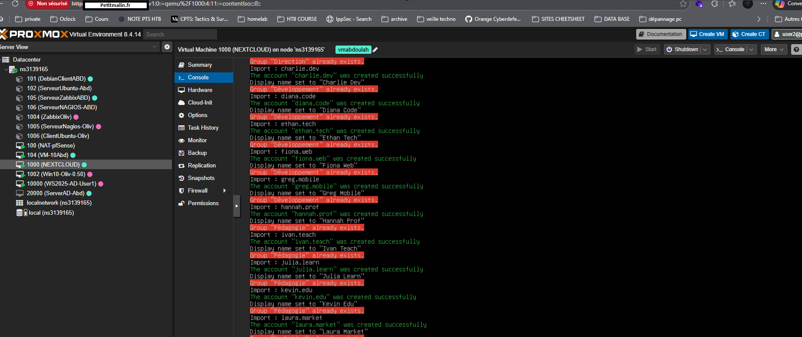

**Rendu final de l'annuaire :**
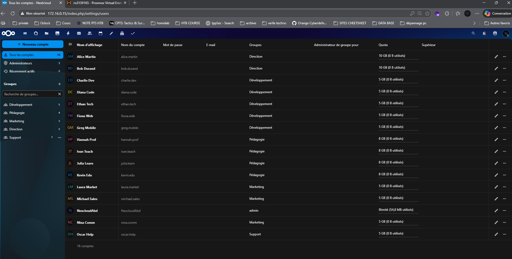

---

## 5. Collaboration et Fonctionnalités

### Arborescence et Partages
Mise en place des dossiers partagés par services.
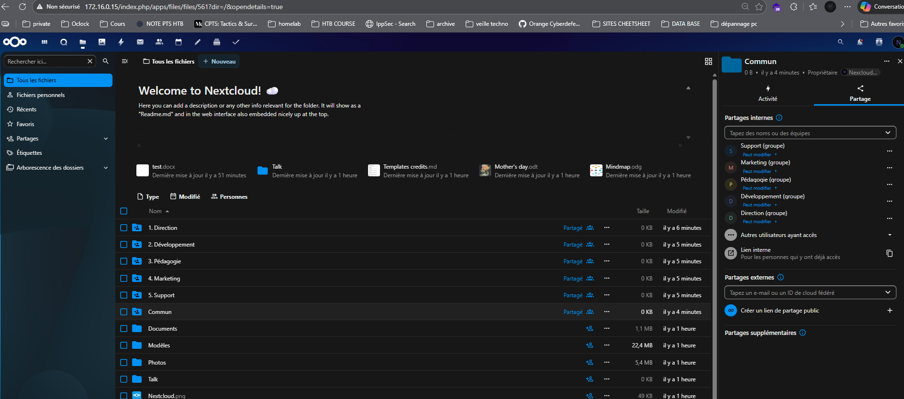

### Communication (Talk)
Configuration des salons de discussion pour les équipes.
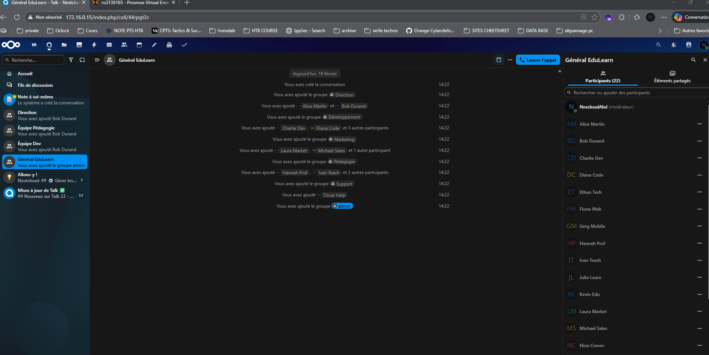

### Calendriers Partagés
Création d'événements tests récurrents :
* **Daily Standup Dev :** Lun-Ven, 9h30–9h45.
* **Rétrospective Sprint :** Vendredi (toutes les 2 semaines), 16h–17h.

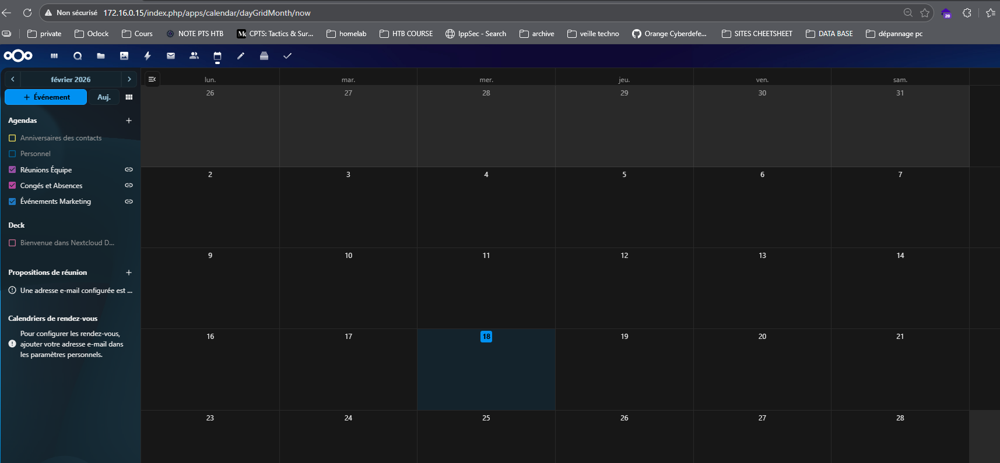
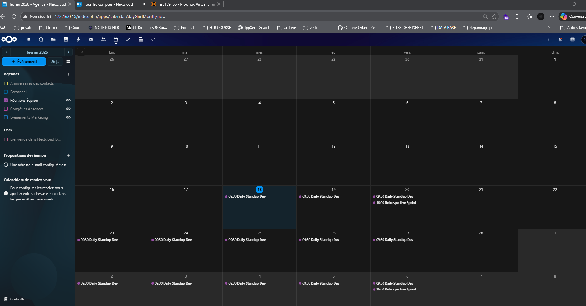

### Gestion de projet (Deck)
Création du board Kanban pour le suivi de projet.
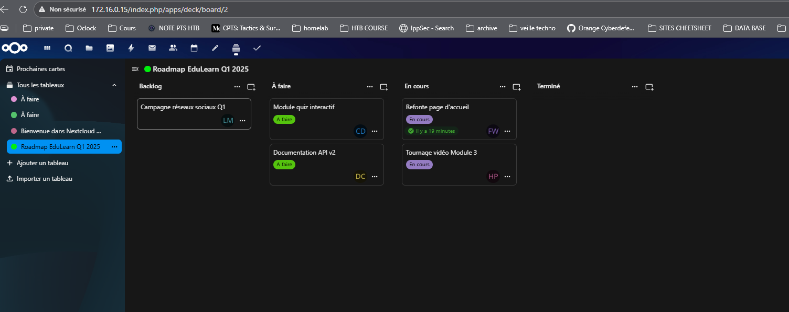

---

## 6. Sécurisation et Validation

### Sécurisation (Bonnes Pratiques)
* **Politique de mots de passe :** Renforcement de la sécurité des comptes. 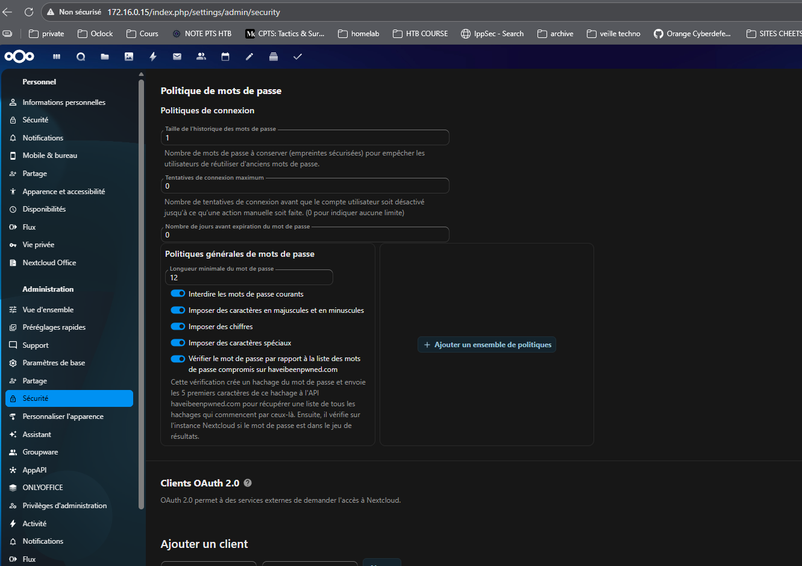
* **Partages externes :** Configuration des accès sécurisés. 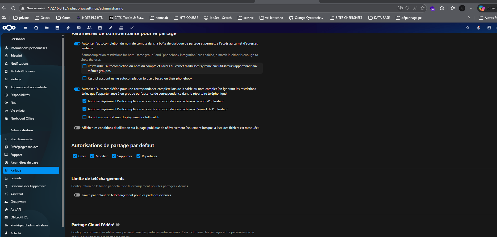

### Tests de Validation
1.  **Connexion Utilisateur :** Test réussi avec le compte `HANNAH PROOF`. 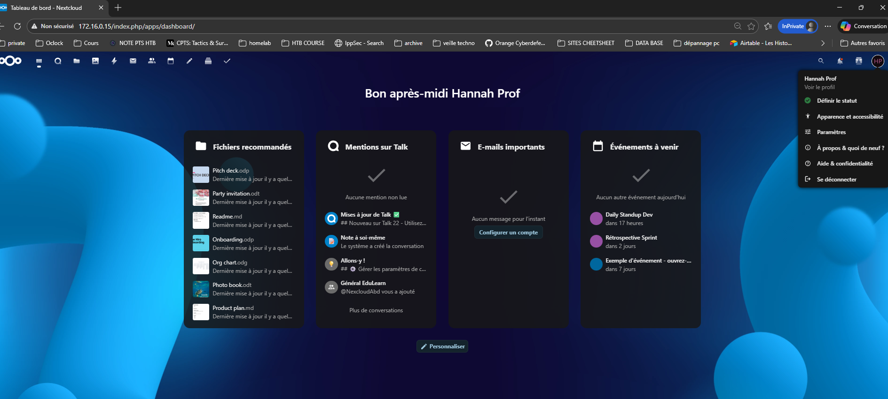
2.  **Co-édition :** Test d'édition simultanée (Bob et Alice) sur ONLYOFFICE. 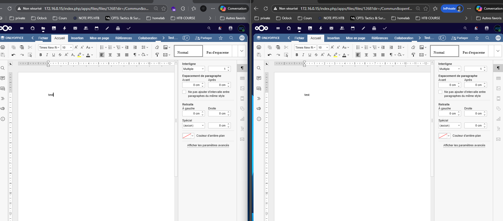
3.  **Visioconférence :** Validation du flux vidéo/audio via Talk. 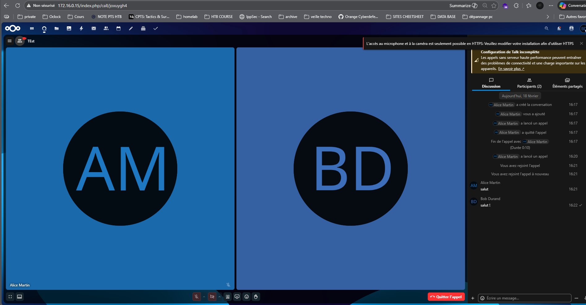

---

## 7. Récapitulatif des Identifiants

| Élément | Valeur |
| :--- | :--- |
| **IP de la VM** | `172.16.0.15` |
| **URL Nextcloud** | `http://172.16.0.15/` |
| **Admin Nextcloud** | `admin` |
| **Utilisateur BDD** | `NexcloudAbd` |
| **Nom de la BDD** | `nextcloud` |

## 8. Rendu Final

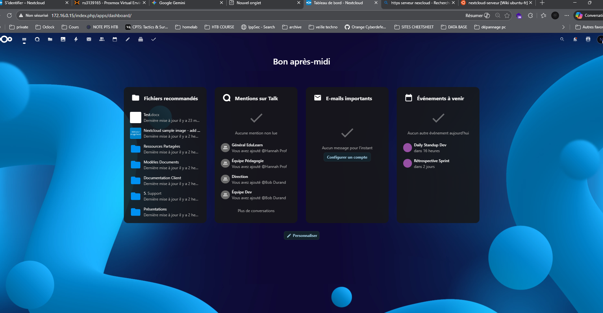