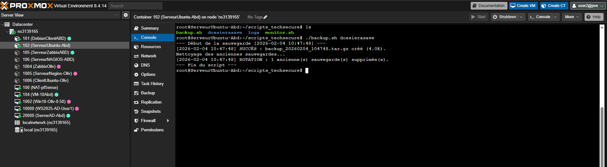
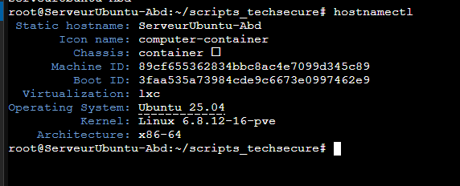
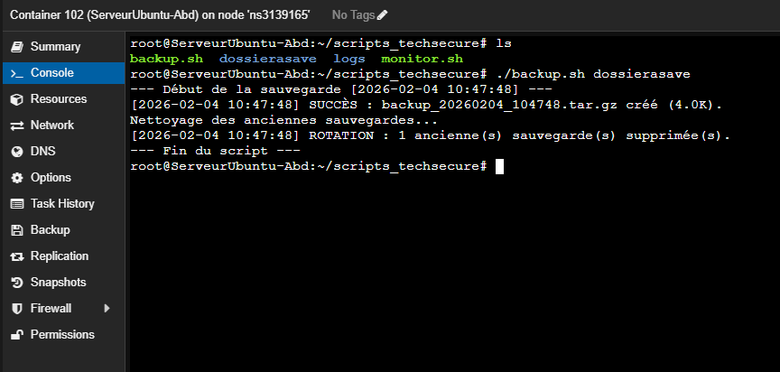
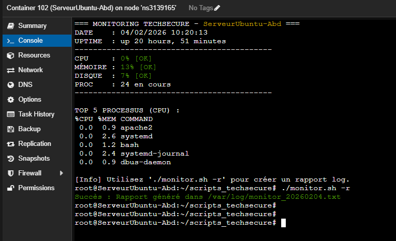
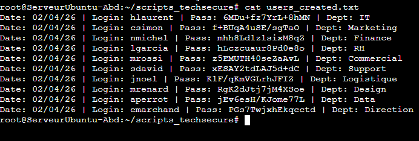
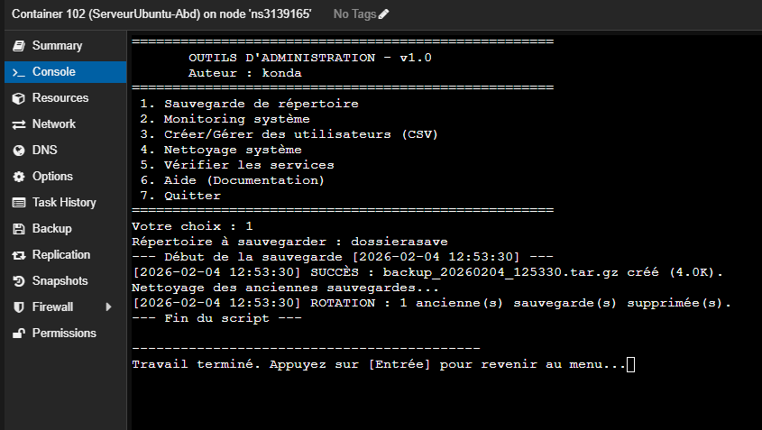

# 🛡️ Atelier Bash - Automatisation de l'administration système (TechSecure)

# 💻 Matériel & Environnement utilisé
> **OS :** Ubuntu 25.04
> **Infrastructure :** Conteneur Linux (LXC) déployé sur **PROXMOX**




---

### Mon rendu :[ ICI !](exercice.md)
----

## 🛠️ Installation et Dépendances

### 1. Prérequis système
Pour garantir le bon fonctionnement de tous les outils (notamment pour les calculs d'espace et la gestion des mots de passe), les paquets suivants doivent être installés :
* **`bc`** : Pour les calculs arithmétiques du script de nettoyage.
* **`openssl`** : Pour la génération sécurisée des mots de passe.
* **`systemd`** : Pour la surveillance de l'état des services.
* **`coreutils`** : Pour les commandes de base (df, awk, etc.).

### 2. Configuration des permissions
Après avoir copié les fichiers dans votre répertoire de travail, rendez tous les scripts exécutables avec la commande suivante :
```bash
chmod +x scripts/*.sh
```

### 2. Configuration des permissions
Créer `services.conf` avec la liste des services (ssh, cron, etc.)

## 📂 Détail des Parties et Utilisation

### Partie 1 : Sauvegarde automatisée (`backup.sh`)
* **Description** : Permet d'archiver et de compresser un répertoire vers une destination de secours avec horodatage.
* **Usage** : `sudo ./backup.sh /chemin/source`
* **Test** : 

### Partie 2 : Moniteur de ressources système (`monitor.sh`)
* **Description** : Affiche l'utilisation CPU, RAM et Disque avec des alertes visuelles.
* **Usage** : `./monitor.sh`
* **Test** : 

### Partie 3 : Gestionnaire d'utilisateurs en masse (`create-users.sh`)
* **Description** : Permet la création ou la suppression d'utilisateurs via un fichier CSV.
* **Usage Création** : `sudo ./create-users.sh users.csv`
* **Usage Suppression** : `sudo ./create-users.sh users.csv -d`
* **Vérification des Logs** : 

### Partie 4 : Nettoyeur de système automatique (`cleanup.sh`)
* **Description** : Nettoyage des fichiers `/tmp`, vieux logs, cache APT et corbeilles.
* **Usage Simulation** : `sudo ./cleanup.sh`
* **Usage Nettoyage réel** : `sudo ./cleanup.sh --force`

### Partie 5 : Vérificateur de santé des services (`check-services.sh`)
* **Description** : Surveille l'état des services critiques définis dans `services.conf`.
* **Usage Watch** : `./check-services.sh --watch`

### Partie 6 : Outil centralisé de gestion (`sysadmin-tools.sh`)
* **Description** : Menu interactif regroupant l'ensemble des fonctionnalités.
* **Usage** : `sudo ./sysadmin-tools.sh`
* **Test** : 

---

## 📦 Livrables et Checklist

### 🛠️ Scripts d'Administration (Exécutables)
- [x] **`backup.sh`** : Sauvegarde et archivage compressé.
- [x] **`monitor.sh`** : Surveillance ressources avec alertes visuelles.
- [x] **`create-users.sh`** : Gestion CSV (Provisioning/Suppression).
- [x] **`cleanup.sh`** : Maintenance (tmp, logs, cache APT).
- [x] **`check-services.sh`** : Monitoring services avec mode `--watch`.
- [x] **`sysadmin-tools.sh`** : Menu interactif centralisé.

### ⚙️ Fichiers de Configuration
- [x] **`users.csv`** : Fichier source pour les comptes utilisateurs.
- [x] **`services.conf`** : Liste des services à surveiller.

### 📚 Documentation & Audit
- [x] **`README.md`** : Documentation complète (Installation/Usage).
- [x] **Journaux système** : Logs générés dans `/var/log/` pour l'audit.