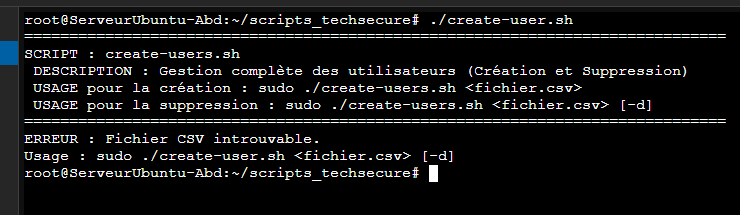
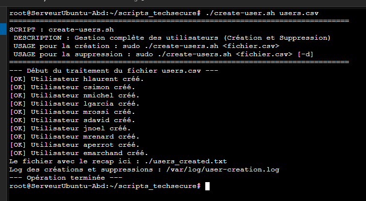
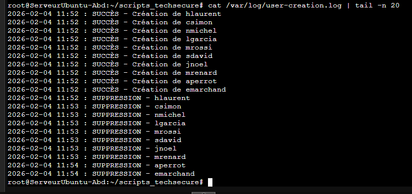
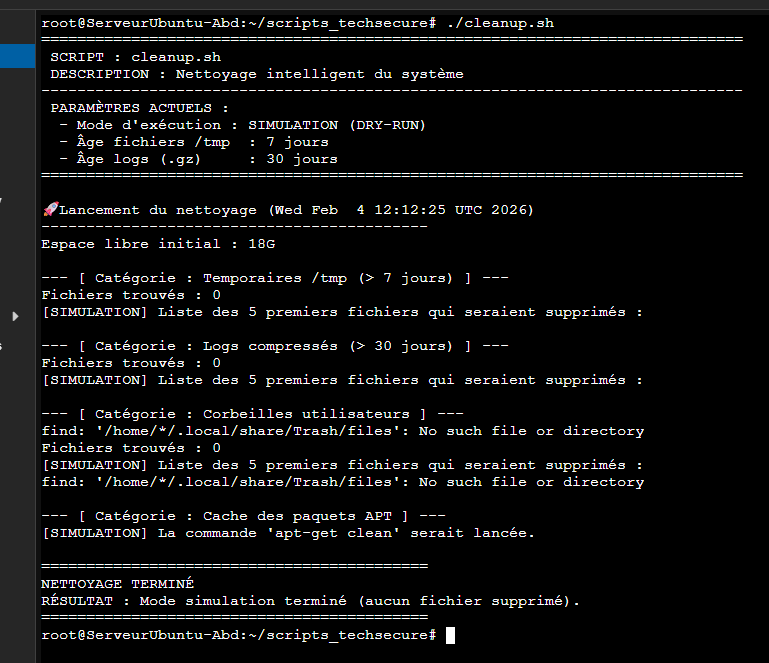
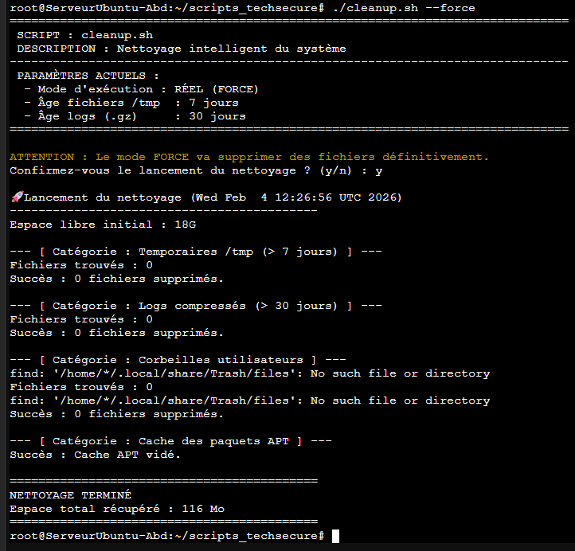
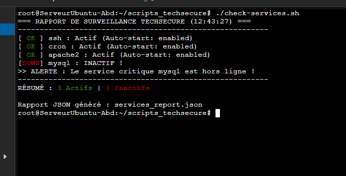
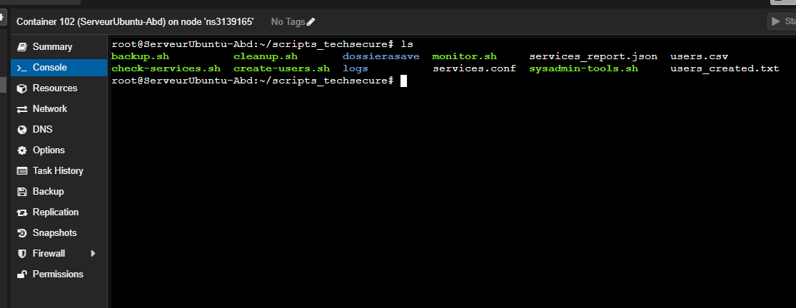

# Atelier Bash - Automatisation de l'administration système

## Contexte professionnel

Vous venez d'être recruté(e) en tant qu'administrateur système Linux chez **TechSecure**, une entreprise hébergeant des applications web pour ses clients. L'infrastructure comprend une vingtaine de serveurs Linux (Debian/Ubuntu) répartis sur plusieurs environnements (développement, staging, production).

Actuellement, la plupart des tâches d'administration sont effectuées **manuellement**, ce qui prend beaucoup de temps et génère des erreurs. Votre manager vous demande de créer une **suite de scripts Bash** pour automatiser les tâches récurrentes d'administration système.

Votre mission : développer des outils d'automatisation robustes, réutilisables et bien documentés qui faciliteront le travail quotidien de l'équipe d'exploitation.

## Objectifs de l'atelier

À l'issue de cet atelier, vous serez capable de :
- Créer des scripts Bash professionnels et maintenables
- Automatiser les tâches courantes d'administration système
- Gérer les erreurs et valider les entrées utilisateur
- Produire des rapports et des logs d'exécution
- Documenter vos scripts pour faciliter leur utilisation

---

> Mon fichier d'exercice :
[ICI !](exercice.md)

# Matériel :

> J'ai utilisé un conteneur linux crée sur PROXMOX avec ubuntu 25.04 comme OS :

## Partie 1 : Script de sauvegarde automatisée

[Mon script de sauvegarde automatisée, clique ici !](scripts/backup.sh)

> Test du script : 

## Partie 2 : Moniteur de ressources système

[Mon script pour monitorer les ressources du système, clique ici !](scripts/monitor.sh)

> Test du script : 

## Partie 3 : Gestionnaire d'utilisateurs en masse

[Mon script pour créer des utilisateurs en masse, clique ici !](scripts/create-users.sh)

[Mon fichier des utilisateurs en *.csv, clique ici !](scripts/users.csv)

> Lancement du script : 

> Test du script *création utilisateurs* : 

> Test du script *suppression utilisateurs* :

> Vérification du fichier des fichiers de logs : 

**fichier de création**

**fichier de de log**

# Partie 4 : Nettoyeur de système automatique

[Mon script de nettoyage du système, clique ici !](scripts/cleanup.sh)

> Vérification du script sans lancement de force : 

> Vérification du script avec lancement de force :

#  Partie 5 : Vérificateur de santé des services

[Mon script de vérification de santé des services, clique ici !](scripts/check-services.sh)

> Vérification du script :

# Partie 6 : Outil centralisé de gestion

[Mon script outil centralisé de gestion, clique ici !](scripts/sysadmin-tools.sh)

> Vérification du script :

# Livrables :

> Lien vers le dossier contenant mes livrables :

[Listes de mes livrables](scripts)

> capture des livrables sur le contenaire LXC : 

# 📑 Checklist des Livrables - Projet TechSecure

## 🛠️ Scripts d'Administration (Exécutables)
- [x] **`backup.sh`** : Automatisation de la sauvegarde et archivage compressé.
- [x] **`monitor.sh`** : Surveillance des ressources (CPU, RAM, Disque) avec alertes visuelles.
- [x] **`create-users.sh`** : Provisioning d'utilisateurs via CSV avec gestion des mots de passe et suppressions.
- [x] **`cleanup.sh`** : Maintenance système (nettoyage `/tmp`, logs, cache APT et corbeille).
- [x] **`check-services.sh`** : Monitoring de l'état des services critiques avec mode `--watch`.
- [x] **`sysadmin-tools.sh`** : Interface unifiée (Menu interactif) pilotant l'ensemble des outils.

## ⚙️ Fichiers de Configuration
- [x] **`users.csv`** : Fichier source pour les comptes utilisateurs (Colonnes : prénom, nom, département, fonction).
- [x] **`services.conf`** : Liste des services système à surveiller (ssh, cron, apache2, mysql...).

## 📚 Documentation & Logs
- [x] **`README.md`** : Documentation complète (Installation, Utilisation, Dépendances).
- [x] **Journaux système** : Logs générés dans `/var/log/` pour l'audit des actions.