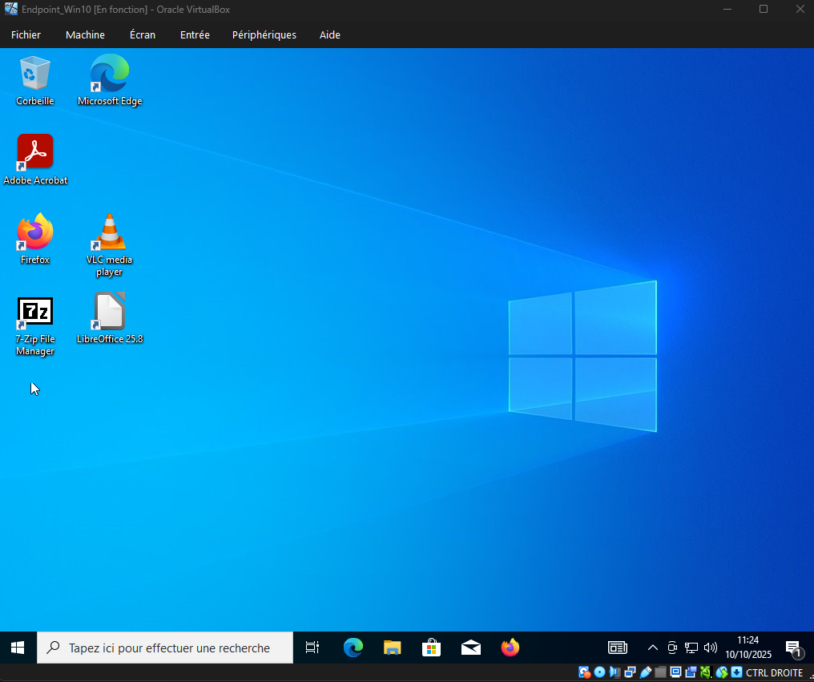
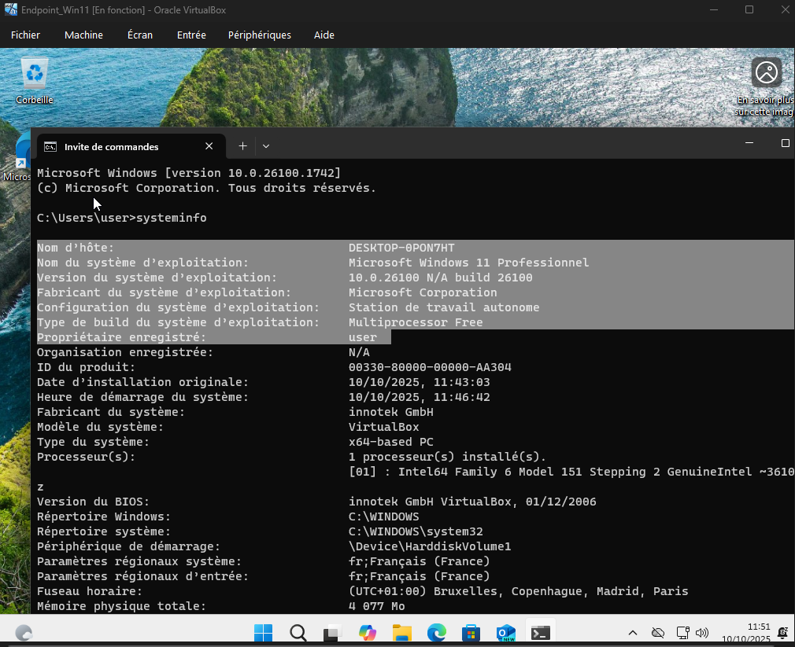
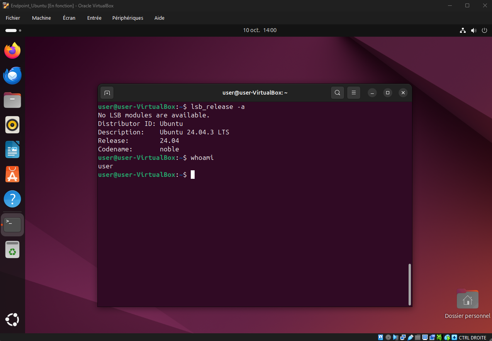

# S01 : Atelier découverte virtualisation

C'est parti pour le premier atelier ! 🎉

## Étape 1 : création de la VM windows 10 et installer des logiciels

## Étape 2 : créer un deuxième utilisateur local

création d'un compte nommé user2 dans le groupe utilisateur.

## Bonus installation Windows 11 + sans devoir utiliser un compte Microsoft

**Procèdure que j'ai appliqué: 
Après l’installation de Windows 11, l'ordinateur redémarre et on arrive sur l’OOBE.
Appuyez simultanément sur les touches sur ⇧ Maj + F10 pour ouvrir le CMD.
Saisissez la commande "start ms-cxh:localonly" puis faire Entrée.
Une nouvelle fenêtre Compte Microsoft s’ouvre, dans laquelle on peut créer un compte utilisateur local.**

## Méga-bonus : installer et utiliser Ubuntu 24.04

## J'ai terminé ! Veille Techno en cours...

