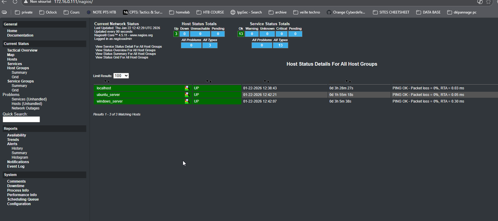
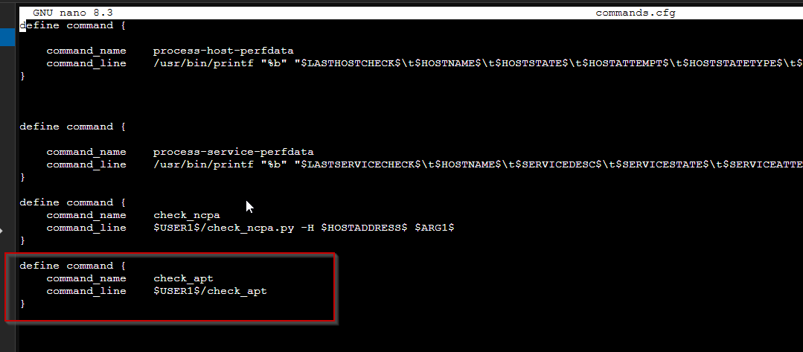
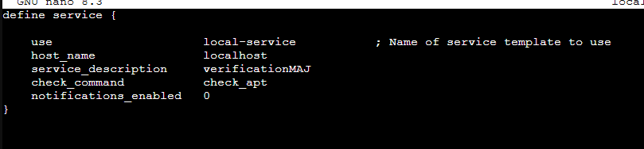
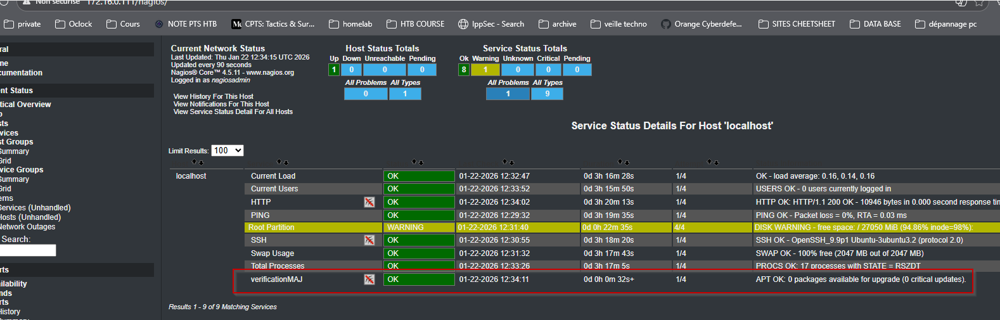
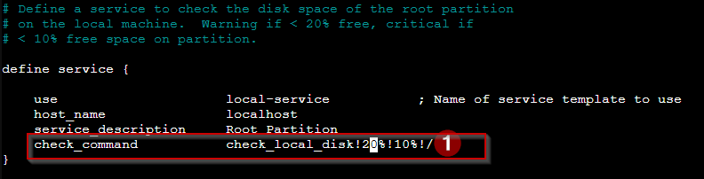
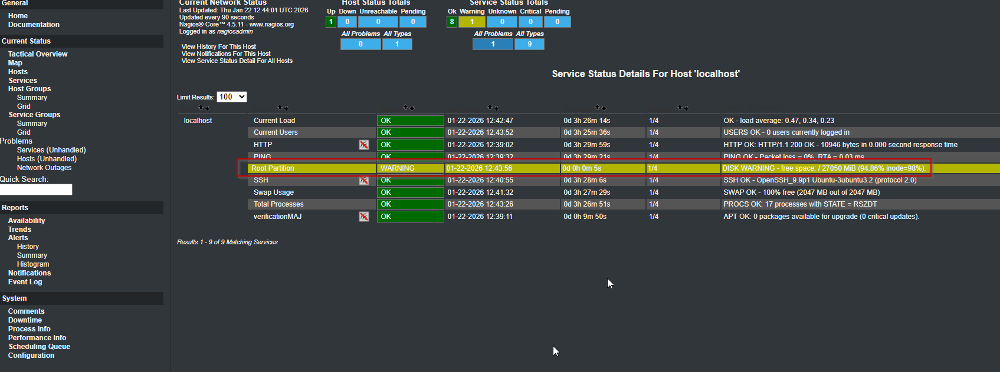

⌨️  
# Challenge – Atelier Nagios

## Objectif

## Introduction à Nagios Core

Après l’installation du serveur **NAGIOS**, des agents sur un serveur **Windows** et **Linux**, ainsi que l’ajout d’un thème :

.

### Bonus

Aller sur le site officiel **NAGIOS** pour consulter les plugins disponibles et leurs explications :  
https://nagios-plugins.org/doc/man/index.html

---

## Configuration de Nagios

Il faut modifier **deux fichiers** :

- `commands.cfg`
- `localhost.cfg`

> Les fichiers sont présents dans /usr/local/nagios/etc/objects
---

## Modification du fichier `commands.cfg`

```bash
sudo nano commands.cfg
```

**rajouter la commande à la fin du fichier et enregistrer** 

```

define command {
    command_name    check_apt
    command_line    $USER1$/check_apt
}

```




```bash
sudo nano localhost.cfg 
```

**rajouter la commande à la fin du fichier et enregistrer** 

```
define service {

    use                     local-service           ; Name of service template to use
    host_name               localhost
    service_description     VerificationMAJ
    check_command           check_apt
    notifications_enabled   0
}
```




> Relancer le service nagios :

```bash
systemctl restart nagios
```

**L'alerte est visible sur le serveur NAGIOS** 




# Test de la remontée d'alertes 

-> Objectif faire remontée l'alerte de remplissage du disque dur.

**La modification est à faire sur dans le fichier :**  

```
/usr/local/nagios/etc/objects/localhost.cfg

modifier la valeur du champ check_local_disk!**100**%!10%!/

```




> Relancer le service nagios :

```bash
systemctl restart nagios
```

-L'alerte remonte bien 

