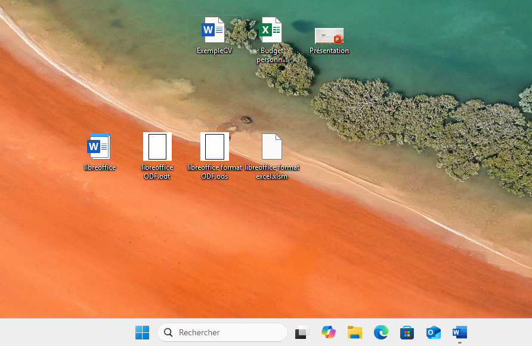

# S03 : Atelier Packet Tracer

## Étape 1 - Plan d'adressage

Proposez un plan d'adressage pour le réseau de l'entreprise.

Nomenclature :

Besoins : 
59 salariés par entreprise  minimum, +200 salariés prévus.
A noter 1 site par département francais, 101 départements

Choix de l'adresse 10.0.0.0/8 pour les sites 

Numéro du site "X" => 10.X.0.0/8
Numéro du type de service "Y" => 10.X.Y.0/8*
*attention parfois il faut sauter un ou plusieurs chiffres en fonction du masque. Comme sur la DMZ sur paris.

Choix de l'adresse 192.168.0.0/16 pour les VPN

### Plan d'adressage :

- Paris :
- LAN (tous les PC fixes et portables) : 10.1.0.0/23 ( 510 hôtes possibles )
    - IP routeur GW : 10.1.0.1/23 port gig 0/3/0
- DMZ : 10.1.2.0/25 ( 126 hôtes possibles )
    - IP routeur GW : 10.1.2.1/25 
- WiFi public : 10.1.3.0/24 ( 254 hôtes possibles )
    - IP routeur GW : 10.1.3.1/24 gig 0/0

- service R&D  : 10.1.10.0/23 ( 510 hôtes possibles )
    - IP routeur GW : 10.1.10.1/23 port gig 0/2/0

- Lille :

- LAN (tous les PC fixes et portables) : 10.2.0.0/23 ( 510 hôtes possibles )
    -  IP routeur GW : 10.2.0.1/23
- WiFi public : 10.2.2.0/24 ( 254 hôtes possibles )
    -  IP routeur GW : 10.2.2.1/24

- VPN : 192.168.0.0/16
    -  IP routeur GW : 192.168.0.1/16

## Étape 2 - Câblage


## Étape 3 - Configuration des switchs

- configurer le `hostname et le mot de passe  `

```Cisco CLI

Switch>enable
Switch#con
Switch#conf t
Enter configuration commands, one per line.  End with CNTL/Z.
Switch(config)#hostname SwitchLanParis
SwitchLanParis(config)#enable secret 1234

```
- configurer le `une adresse IP sur l'interface Vlan1  `


```Cisco CLI

Commands : 

WifiParis>enable
Password: 
WifiParis#conf t
WifiParis(config)#interface vlan 1
WifiParis(config-if)#ip address 10.1.3.5 255.255.255.0
WifiParis(config-if)#no shutdown
show ip interface brief
WifiParis#copy run sta
Destination filename [startup-config]? 
Building configuration...

show ip interface brief


```

Vérification de la configuration ok ! 

Interface              IP-Address      OK? Method Status                Protocol 
Vlan1                  10.1.3.5        YES manual up                    up


Test de la connection via un pc , ip fixe // ok sur tt les switchs




## Étape 4 - Configuration initiale des routeurs


Configuration routeur coeur de réseau PARIS : 

- WiFi public : 10.1.3.0/24 ( 254 hôtes possibles )
    - IP routeur GW : 10.1.3.1/24 gig 0/0

- LAN (tous les PC fixes et portables) : 10.1.0.0/23 ( 510 hôtes possibles )
    - IP routeur GW : 10.1.0.1/23 port gig 0/3/0

- service R&D  : 10.1.10.0/23 ( 510 hôtes possibles )
    - IP routeur GW : 10.1.10.1/23 port gig 0/2/0

- DMZ : 10.1.2.0/25 ( 126 hôtes possibles )
    - IP routeur GW : 10.1.2.1/25 gig 0/1

 Paris vers LILLE 92.12.34.1/24 gig 0/0/0


Configuration Routeur LILLE :

- LAN (tous les PC fixes et portables) : 10.2.0.0/23 ( 510 hôtes possibles )
    -  IP routeur GW : 10.2.0.1/23 port gig 0/3/0
- WiFi public : 10.2.2.0/24 ( 254 hôtes possibles )
    -  IP routeur GW : 10.2.2.1/24 port gig 0/1

Connection entre PARIS et LILLE 
 Sur routeur Coeur de réseau Paris vers LILLE 92.12.34.1/24 gig 0/0/0
 Sur routeur LILLE vers PARIS IP 92.12.34.2/24 gig 0/2/0 

 
VPN : 
- 92.56.78.1/24 pour le routeur de Paris port Se0/1/0
- 92.56.78.2/24 pour le routeur du VPN   port Se0/0/0

## Étape 5 - Routes statiques

### Je dois configurer les 2 routeurs situés dans les 2 différents réseaux, dans mon cas : cœur de réseau et routeur du réseau VPN.

### Formule appliquée

```
[ip sous-réseau ciblé] [son masque] [ip du premier routeur par lequel il faut passer]
```

### Pour aller de VPN jusqu'à Paris R&D (configuration du routeur VPN)

```
VPNrouteur(config)#ip route 10.1.10.0 255.255.254.0 92.56.78.1
```

### Pour aller de Paris R&D jusqu'à VPN (configuration du routeur Cœur de réseau à Paris)

```
leCOEUR!(config)#ip route 192.168.0.0 255.255.0.0 92.56.78.2
```

### Routeur VPN — Configuration

De VPN vers LAN PARIS :
```
VPNrouteur(config)#ip route 10.1.0.0 255.255.254.0 92.56.78.1
```

De VPN vers Wifi public PARIS :
```
VPNrouteur(config)#ip route 10.1.3.0 255.255.255.0 92.56.78.1
```

De VPN vers DMZ PARIS :
```
VPNrouteur(config)#ip route 10.1.2.0 255.255.255.128 92.56.78.1
```

Pour Cœur vers VPN (déjà configuré plus haut) :
```
leCOEUR!(config)#ip route 192.168.0.0 255.255.0.0 92.56.78.2
```

### Sur Cœur de réseau vers LAN LILLE et WIFI public LILLE

```
leCOEUR!(config)#ip route 10.2.0.0 255.255.254.0 92.12.34.2
leCOEUR!(config)#ip route 10.2.2.0 255.255.255.0 92.12.34.2
```

### Sur routeur LILLE vers les différents LAN de Paris et VPN

En configuration statique :
```
ip route 192.168.0.0 255.255.0.0 92.12.34.1
ip route 10.1.0.0 255.255.254.0 92.12.34.1
ip route 10.1.3.0 255.255.255.0 92.12.34.1
ip route 10.1.2.0 255.255.255.128 92.12.34.1
ip route 10.1.10.0 255.255.254.0 92.12.34.1
```

En configuration par défaut / route statique par défaut :
```
RouteurLILLE(config)#ip route 0.0.0.0 0.0.0.0 92.12.34.1
```

### Routeur VPN vers Routeur LILLE

```
VPNrouteur(config)#ip route 10.2.0.0 255.255.254.0 92.56.78.1
VPNrouteur(config)#ip route 10.2.2.0 255.255.255.0 92.56.78.1
```

Test de la route du pc 10.0.0.6 LAN LILLE jusqu'à R&D paris , connection ok :


Les autres connections fonctionnes aussi

## Étape 6 - DHCP

Sur LILLE , j'ai 2 sous réseaux 


Configuration du routeur de LILLE : 

LAN 10.2.0.0/23 
Masque décimale : 255.255.254.0
GW : 10.2.0.1 (default router)

```
RouteurLILLE>enable
RouteurLILLE#conf t
Enter configuration commands, one per line.  End with CNTL/Z.
RouteurLILLE(config)#ip dhcp pool LANLILLE
RouteurLILLE(dhcp-config)#network 10.2.0.0 255.255.254.0
RouteurLILLE(dhcp-config)#default-routeur 10.2.0.1

RouteurLILLE#show run
```

WIFI Public 10.2.2.0/24
Masque décimale : 255.255.255.0
GW : 10.2.2.1 (default router)


```
RouteurLILLE(config)#ip dhcp pool WIFIPublicLILLE
RouteurLILLE(dhcp-config)#network 10.2.2.0 255.255.255.0
RouteurLILLE(dhcp-config)#default-router 10.2.2.1
RouteurLILLE#show run
RouteurLILLE#copy run sta
```


Les serveurs et copieurs doivent avoir des adresses IP statiques.

Sur le routeur coeur de réseau vers DMZ , réservation de 10 adresses pour serveurs.


```
Pour exclure des adresses du DHCP pour dédié des IP aux serveurs et copieurs.

leCOEUR!(config)#ip dhcp excluded-address 10.1.2.50 10.1.2.60
leCOEUR!(config)#ip dhcp pool DMZPARIS
leCOEUR!(dhcp-config)#network 10.1.2.0 255.255.255.128
leCOEUR!(dhcp-config)#default-router 10.1.2.1
leCOEUR!#show run

```

Configuration sur routeur PARIS vers WIFI PUBLIC 

```
leCOEUR!(config)#ip dhcp pool wifipublicparis
leCOEUR!(dhcp-config)#network
leCOEUR!(dhcp-config)#network 10.1.3.0 255.255.255.0
leCOEUR!(dhcp-config)#default-router 10.1.3.1
```

Vérification des configurations DHCP de tous les routeurs via la commande : show run

Fin de configuration du routeur PARIS coeur de réseau :


```
hostname leCOEUR!
!
!
!
enable secret 5 $1$mERr$4dpRATIgxQacPVK0CfNV4/
!
!
ip dhcp excluded-address 10.1.2.50 10.1.2.60
ip dhcp excluded-address 10.1.10.50 10.1.10.60
ip dhcp excluded-address 10.1.0.50 10.1.0.60
!
ip dhcp pool DMZPARIS
 network 10.1.2.0 255.255.255.128
 default-router 10.1.2.1
ip dhcp pool wifipublicparis
 network 10.1.3.0 255.255.255.0
 default-router 10.1.3.1
ip dhcp pool LANPARIS
 network 10.1.0.0 255.255.254.0
 default-router 10.1.0.1
ip dhcp pool PARISR&D
 network 10.1.10.0 255.255.254.0
 default-router 10.1.10.1

 ```

 Fin de configuration du routeur VPN  :

```
 ip dhcp pool VPN
 network 192.168.0.0 255.255.0.0
 default-router 92.56.78.2
 ```

  Fin de configuration du routeur LILLE  :

```
  ip dhcp pool LANLILLE
 network 10.2.0.0 255.255.254.0
 default-router 10.2.0.1
ip dhcp pool WIFIPublicLILLE
 network 10.2.2.0 255.255.255.0
 default-router 10.2.2.1
 ```

Vérification sur tout les PC , l'ip se met bien automatiquement ainsi que la GW.

Exemple sur le laptop0 de WIFIPublic de PARIS :


 # Bonus

 Remplacement des switchs 2960 utilisés pour le WiFi par des point d'accès WiFi !
Utilisation de AP-PT (Access Point) dans Packet Tracer, dans la catégorie `Network devices` > `Wireless`.

 ## Avant : 

 

 ### Après : 

 utilisation des équipements suivantes :

MODEM ACCESS POINT-PT 
Sur les PC : CARTE WIFI WPC300N


test de connectivité toujours ok ! DHCP , ping fonctionnels.

 # BIG Bonus

UNDER CONSTRUCTION 


