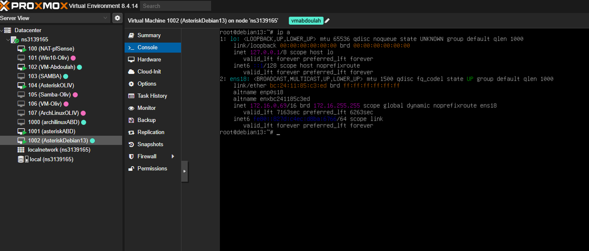
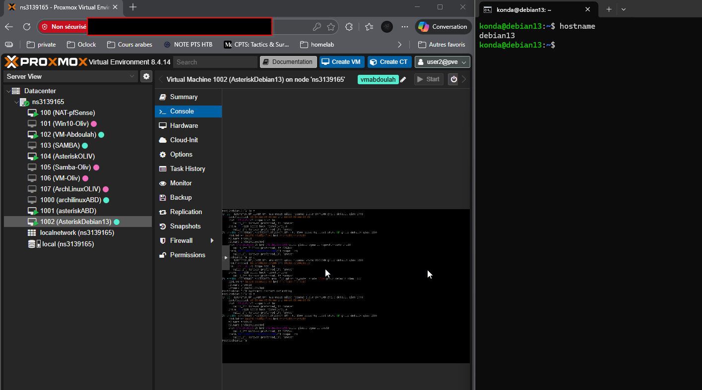
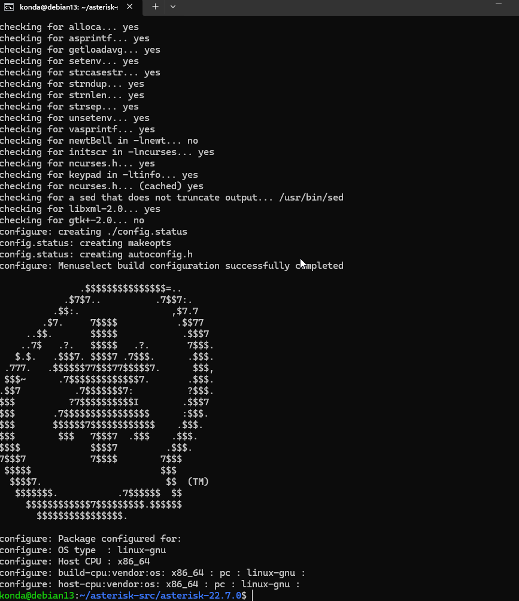
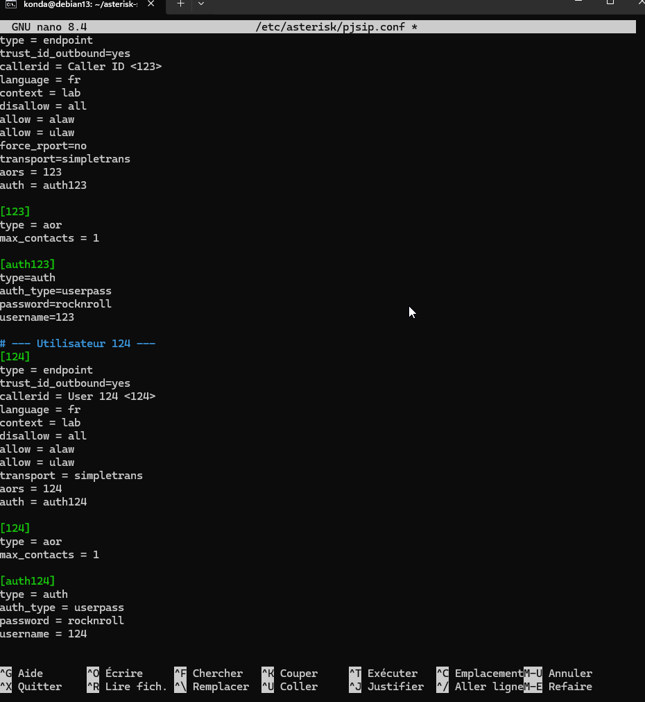
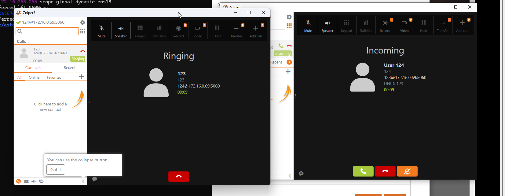
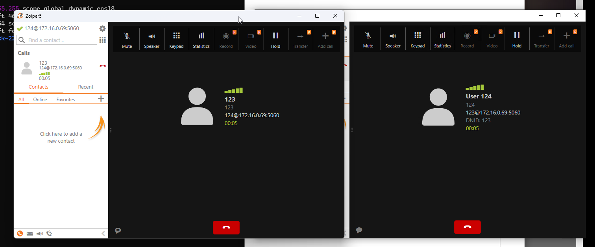
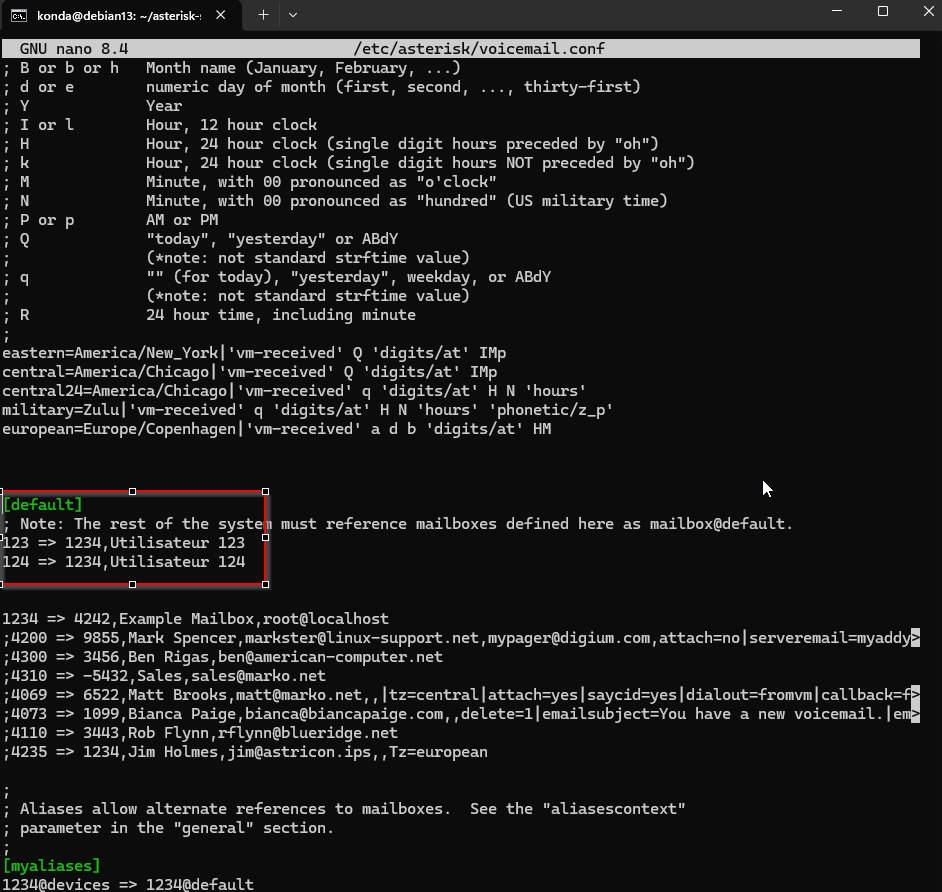
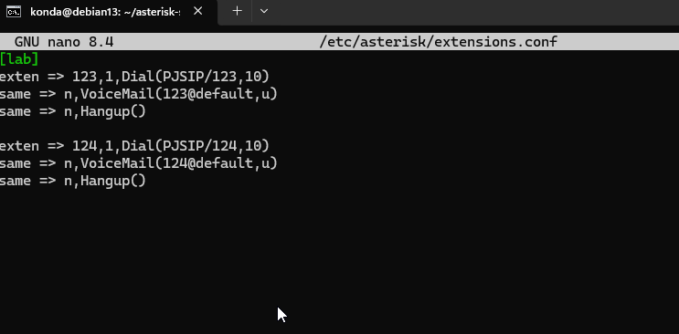
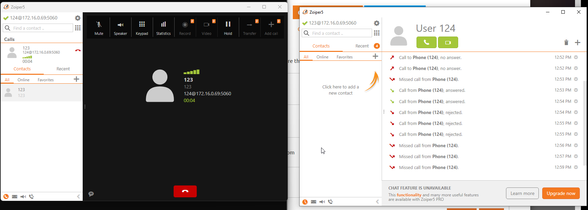

# E06 - Atelier IPBX Asterisk sur Debian 13

## Étape 1 : installation Debian 13 sur proxmox 

## Étape 2 : sudo, IP statique & SSH

> Connection via ssh depuis mon hôte.

## Étape 3 : Installation d'Asterisk

## Étape 4 : Configuration d'Asterisk

###  Test de communication entre 2 users "123" sur pc hôte et "124" sur pc VM Windows proxmox  : 

##  Bonus :

> messagerie/boîte vocale

Modification du fichier voicemail.conf : 
nano /etc/asterisk/voicemail.conf

Modification du fichier extensions.conf : 
sudo nano /etc/asterisk/extensions.conf

> test de communication , messagerie ok après 10 seconde ! 

